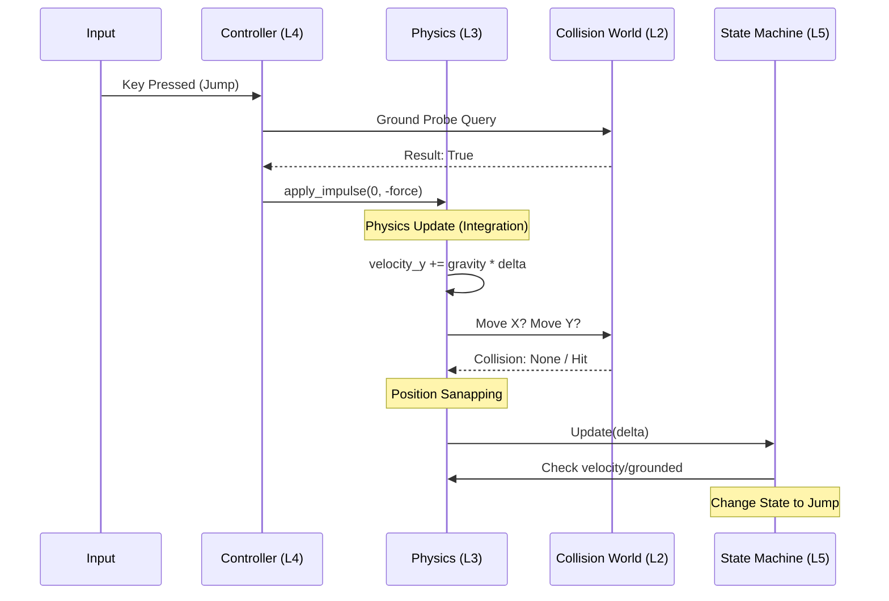

# Architecture Deep Dive: Layered Interaction

This document explains how the different layers of **PyEngine 2D** work together to create a cohesive simulation.

## 1. The Hierarchy of Layers

The engine is designed as a strict "cake" of responsibilities. Higher layers depend on lower layers, but lower layers NEVER know about higher ones.

| Layer | Responsibility | Component |
| :--- | :--- | :--- |
| **5. State (FSM)** | High-level "Behavioral" identity (Idle, Run, Jump, Fall). | `PlayerStateMachine` |
| **4. Gameplay** | Translation of intent (Input/AI) into forces. | `PlayerController` |
| **3. Physics** | Accumulation of forces (Gravity, Velocity) into motion. | `PhysicsBody2D` |
| **2. Collision** | Geometric queries (Am I hitting something?). | `CollisionWorld` |
| **1. Scene** | Spatial hierarchy and transform propagation. | `Node2D` |
| **0. Runtime** | The engine heartbeat (Game loop, Delta time). | `main.py` |

---

## 2. The Execution Flow (The Frame Lifecycle)

In every frame, the `Player.update(delta)` method manages the handoff between these layers. The order is critical:

### Step A: Gameplay Intent (The "What")
- **Layer 4 (`PlayerController`)** reads the Input State.
- If "Right" is held, it increases `player.velocity_x`.
- If "Jump" is pressed AND the ground probe returns True, it calls `apply_impulse()`.
- **Status**: The player hasn't moved yet. We only changed the *numbers* representing its speed.

### Step B: Physics Integration (The "How")
- **Layer 3 (`PhysicsBody2D`)** adds gravity to `velocity_y`.
- It calculates displacement: `dx = velocity_x * delta`.
- It calls `move_and_collide()`.

### Step C: Collision Resolution (The "Where")
- **Layer 2 (`CollisionWorld`)** is queried twice (once for X, once for Y).
- It checks if the target position overlaps any other `Collider2D`.
- If a hit occurs, the Physics layer **snaps** the player's position to the obstacle's edge and zeroes the velocity on that axis.
- **Status**: The player is now at its final spatial position for this frame.

### Step D: State Observation (The "Result")
- **Layer 5 (`PlayerStateMachine`)** looks at the *final* results of the frame.
- It checks: "Is my final `velocity_y` positive?" → Transition to **FallState**.
- It checks: "Is my final `velocity_x` zero?" → Transition to **IdleState**.
- **Status**: Logic is determined based on the outcome of the physics simulation.

---

## 3. Interaction Diagram

---

## 4. Implemented Optimizations & Solutions

We have recently implemented a **Performance & Consistency Patch** to address potential simulation artifacts:

### ✅ Deterministic Jumps (Fixed Timestep)
**Solution**: We transitioned from variable delta timing to a **Fixed Physics Timestep (Accumulator)** in `main.py`.

- Physics now always advances in precise `1/60` second increments.
- This ensures that jumping results in the exact same trajectory regardless of the rendering framerate.

### ✅ Optimized Performance (Collider Caching)
**Solution**: We implemented **O(N) Collider Caching** in `CollisionWorld`.

- Instead of recursively walking the entire scene graph for every collision check, the world flattens the collider list and pre-calculates their world-space bounding boxes once per step.
- This eliminates "Frame Falls" caused by expensive scene traversals.

### ✅ Stable Snapping (Zero-Velocity Resolution)
**Solution**: By resolving X and Y independently and using a fixed timestep, we've eliminated "Ghost Collisions."

- When hitting a ceiling or wall, the specific velocity component is zeroed immediately, preventing "vibration" or sticking against surfaces.
