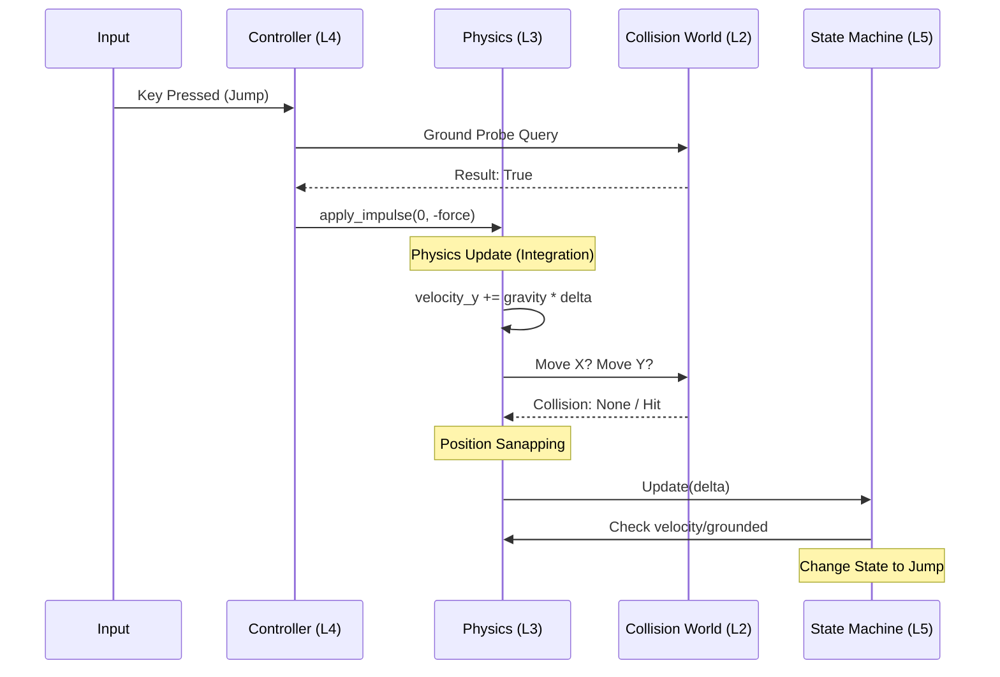

# Architecture Deep Dive: Layered Interaction

This document explains how the different layers of **PyEngine 2D** work together to create a cohesive simulation.

## 1. The Hierarchy of Layers

The engine is designed as a strict "cake" of responsibilities. Higher layers depend on lower layers, but lower layers NEVER know about higher ones.

| Layer                      | Responsibility                                            | Component                   |
| :------------------------- | :-------------------------------------------------------- | :-------------------------- |
| **8. Audio**               | SFX and music playback globally.                          | `AudioManager`              |
| **7. User Interface (UI)** | Menus, HUDs, Event Propagation, Data binding.             | `UIControl` / `EventSystem` |
| **6. Juice & Animation**   | Visual polish, tweening, effects.                         | `TweenManager`              |
| **5. State (FSM)**         | High-level "Behavioral" identity (Idle, Run, Jump, Fall). | `PlayerStateMachine`        |
| **4. Gameplay**            | Translation of intent (Input/AI) into forces.             | `PlayerController`          |
| **3. Physics**             | Accumulation of forces (Gravity, Velocity) into motion.   | `PhysicsBody2D`             |
| **2. Collision**           | Geometric queries (Am I hitting something?).              | `CollisionWorld`            |
| **1. Scene**               | Spatial hierarchy, transforms, and tilemap rendering.     | `Node2D` / `TilemapNode`    |
| **0. Runtime**             | The engine heartbeat (Game loop, Delta time).             | `Engine`                    |

---

## 2. The Execution Flow (The Frame Lifecycle)

In every frame, the `Player.update(delta)` method manages the handoff between these layers. The order is critical:

### Step A: Event Interception & UI (The "Overlay")

- **Layer 7 (`EventSystem` & UI)** listens for raw input events (like clicks).
- UI Control nodes intercept and consume these events to trigger buttons or drag operations.
- **Status**: If consumed, events do not propagate to gameplay, preventing "punch-through" actions.

### Step B: Gameplay Intent (The "What")

- **Layer 4 (`PlayerController`)** reads the remaining unconsumed Input State.
- If "Right" is held, it increases `player.velocity_x`.
- If "Jump" is pressed AND the ground probe returns True, it calls `apply_impulse()`.
- **Status**: The player hasn't moved yet. We only changed the _numbers_ representing its speed.

### Step C: Physics Integration (The "How")

- **Layer 3 (`PhysicsBody2D`)** adds gravity to `velocity_y`.
- It calculates displacement: `dx = velocity_x * delta`.
- It calls `move_and_collide()`.

### Step D: Collision Resolution (The "Where")

- **Layer 2 (`CollisionWorld`)** is queried twice (once for X, once for Y).
- It checks if the target position overlaps any other `Collider2D`.
- If a hit occurs, the Physics layer **snaps** the player's position to the obstacle's edge and zeroes the velocity on that axis.
- **Status**: The player is now at its final spatial position for this frame.

### Step E: State Observation (The "Result")

- **Layer 5 (`PlayerStateMachine`)** looks at the _final_ results of the frame.
- It checks: "Is my final `velocity_y` positive?" → Transition to **FallState**.
- It checks: "Is my final `velocity_x` zero?" → Transition to **IdleState**.
- **Status**: Logic is determined based on the outcome of the physics simulation.

---

## 3. Interaction Diagram


```mermaid
sequenceDiagram
    participant I as Input
    participant C as Controller (L4)
    participant P as Physics (L3)
    participant W as Collision World (L2)
    participant F as State Machine (L5)

    I->>C: Key Pressed (Jump)
    C->>W: Ground Probe Query
    W-->>C: Result: True
    C->>P: apply_impulse(0, -force)

    Note over P: Physics Update (Integration)
    P->>P: velocity_y += gravity * delta
    P->>W: Move X? Move Y?
    W-->>P: Collision: None / Hit
    Note over P: Position Sanapping

    P->>F: Update(delta)
    F->>P: Check velocity/grounded
    Note over F: Change State to Jump
```

---

## 4. Implemented Optimizations & Solutions

We have recently implemented a **Performance & Consistency Patch** to address potential simulation artifacts:

### ✅ Deterministic Jumps (Fixed Timestep)

**Solution**: We transitioned from variable delta timing to a **Fixed Physics Timestep (Accumulator)** in `main.py`.

- Physics now always advances in precise `1/60` second increments.
- This ensures that jumping results in the exact same trajectory regardless of the rendering framerate.

### ✅ Optimized Performance (Collider Caching & SAT)

**Solution**: We implemented **O(N) Collider Caching** and a Spatial Grid in `CollisionWorld`.

- Instead of recursively walking the entire scene graph for every collision check, the world flattens the collider list and pre-calculates their world-space bounding boxes once per step.
- Convex Polygons invoke the **Separating Axis Theorem (SAT)** narrow-phase algorithm only after a successful broad-phase AABB hit.
- This eliminates "Frame Falls" caused by expensive scene traversals.

### ✅ Stable Snapping (Zero-Velocity Resolution)

**Solution**: By resolving X and Y independently and using a fixed timestep, we've eliminated "Ghost Collisions."

- When hitting a ceiling or wall, the specific velocity component is zeroed immediately, preventing "vibration" or sticking against surfaces.

---

## 5. Tilemap Level Pipeline

The `TilemapNode` + `draw2d.py` editor form a complete level design pipeline:

```
draw2d.py (Map Editor)
  → Press [S] to save JSON to maps/map_data.json
  → JSON contains tile grid + offset_x/offset_y + tileset reference

TilemapNode.load_from_json()
  → Reads offset → sets local_x, local_y for world-space placement
  → Bakes all layers to cached surfaces (O(1) blit per frame)
  → Auto-generates merged row Collider2D nodes for solid layers
  → Streams only visible tiles during render (viewport culling)
```

This keeps `level.py` minimal — it just calls `tilemap.load_from_json(map_path)` and adds the node to the scene tree. Geometry is fully data-driven.
